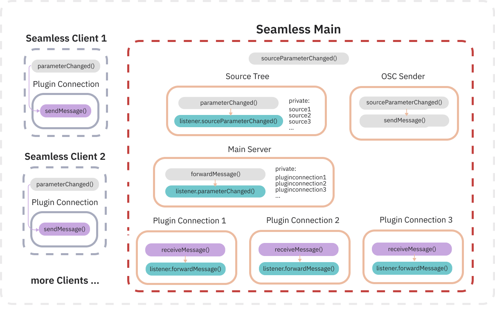

# Seamless Plugin Suite

<!-- TODO: link to seamless docs -->

Suite of VST-Plugins and Standalone Applications to easily control the Seamless system using OSC-Messages.

## Usage

Put the Main Plugin on the Master Bus of your DAW, set ip and port to the receiver (usually an OSC-Kreuz instance). Then add Client Plugins to all tracks that should be spatialized.



### control using external OSC
The Main plugins listen for external OSC-Messages on the port specified in the main plugin. The following data paths are supported:

| OSC-Path | data format | comment |
| --- | --- | --- |
| `/source/pos/xyz` | `ifff` source_index, x, y, z | x,y,z should be between -1 and 1, values outside this range will be clipped by the plugins |
| `/source/send` | `iif` source_index, renderer_index, gain | renderer_index starts from 0, with 0 being ambisonics and 1 being wfs, gain should be between 0 and 1|

## Development

Clone the repo

update submodules with

```bash
git submodule update --init --recursive
```
